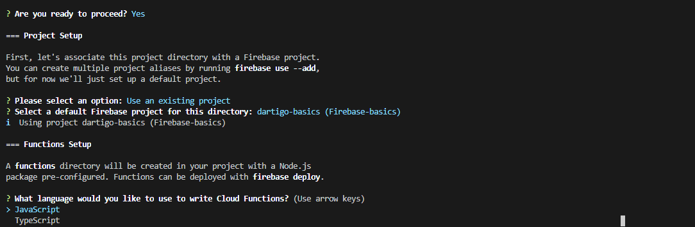
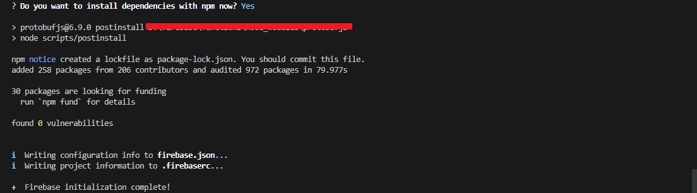
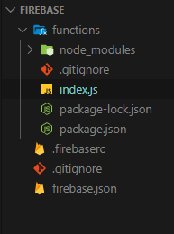
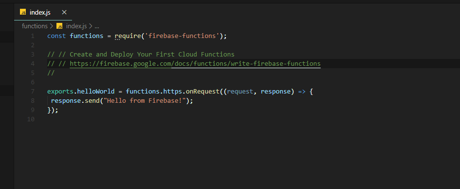
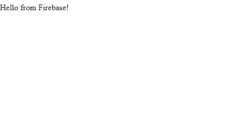
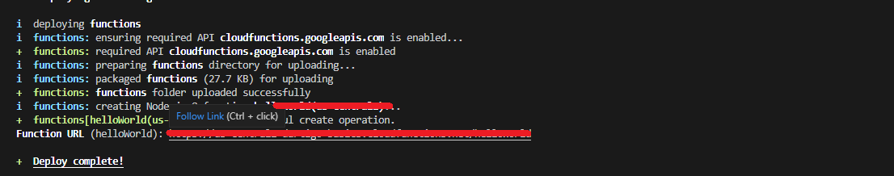
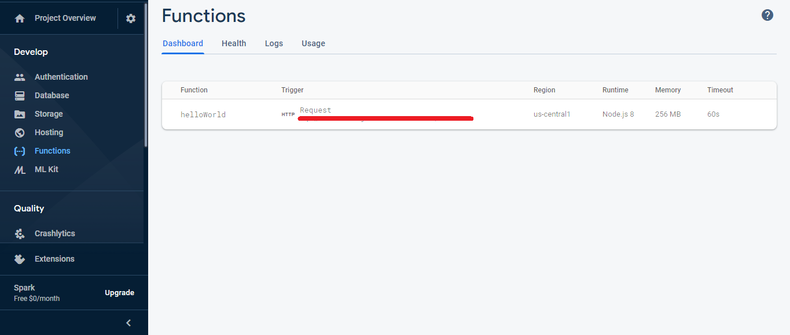

> Let's continue to explore firebase

***

Make sure to read [Part-1](/firebase-basics) before you begin

***

In the previous session we created an account and started a new firebase project. And today we'll make our hands dirty. This part requires some coding. We'll be using using *nodeJS*, so make sure you know a little bit of that and ExpressJs.

## Prerequisites

- Install [nodeJS](http://https://nodejs.org/en/download/)
- An IDE. You can use your favourite one. But we recommend using [VSCode](http://https://code.visualstudio.com/)

## Introduction

In the previous part of this series we created a new firebase project. And Today we'll explore `CLOUD FUNCTIONS`.

## Cloud Functions??

Cloud Functions for Firebase is a serverless framework that lets you automatically run backend code in response to events triggered by Firebase features and HTTPS requests. Your JavaScript or TypeScript code is stored in Google's cloud and runs in a managed environment. There's no need to manage and scale your own servers.

## Setting Up the environment

To start coding a cloud function. We must set up an environment with emulators and stuff so tht we can test our code on our machine itself before deploying it to the GCP.
 ### To install the firebase CLI

 After you install NodeJS you can install firebase CLI using npm by using this command:

 ```bash
npm install firebase-tools -g
 ```

 This will install firebase CLI globally on your system.

 ### Initiating the project on your system
 ***
 Login into your Google account using the command:
 ```bash
 firebase Login
 ```

 After you do that you'll get a link. Open that link in your browser and login with your account.

 ***
Now in order to initiate the project use command prompt or terminal to navigate into the directory where you want to set as the workspace. Then:
```bash
firebase init functions
```


When you are asked to select a project option. Select the `use existing project option` and select your project from the list. And for the languages option use JavaScript as we'll be using that. We may not need the ESLint. But you can go with it if you need it. Make sure to install all the dependencies from npm



And there you go the initialisation is complete.

## First Piece of code
Take a look at your workspace. The directory should have some new files by now along with a new folder called functions.



And in that folder you'll see an `index.js` file. That's the file where you should write the code. Open that. You'll see some commented lines. You've to uncomment some lines to make it as follows:



If you've ever used expressJs, You'll feel at home now because firebase uses express.
And this will be the first piece of code we gonna deploy.

```js
const functions = require('firebase-functions'); 
```

This code imports firebase functions into your code. 

```js
exports.helloWorld = functions.https.onRequest((request,response)=>{
    response.send("Hello World from firebase");
});
```

This is our http request triggered cloud function with a name `helloWorld`.
Once it get an http trigger, the function is initiated and it sends a response.
***
## Testing locally with emulator

So now to test our function:

```bash
firebase serve
```

This should start a server and you'll get a link on localhost. Open that link and you'll be able to see your code in action.



We made the stupidest app ever. But yeah it's the Hello world app. You can make changes as you like if you know express.

## Deploying it

We've seen our code running smoothly without any issues(As there's nothing to cause an issue, because its such a silly code). It is running on our local machine. Now to put it into the cloud, use:

```bash
firebase deploy
```



You'll get the link of your deployed code under function url. Open it:


Woohoo. That stupid thing is on cloud. Now head over to your firebase console and open the functions from the navigation panel on left(or whatever you call it).



You can see the statistics of your function there.

## Winding up

So We have our first code on firebase. Now its useless and dumb and soe nothing at all. We'll try to create an API with the help of firestore in the next part of this series.

> Thank you. We'll continue to explore more  in the coming sessions. Keep exploring.