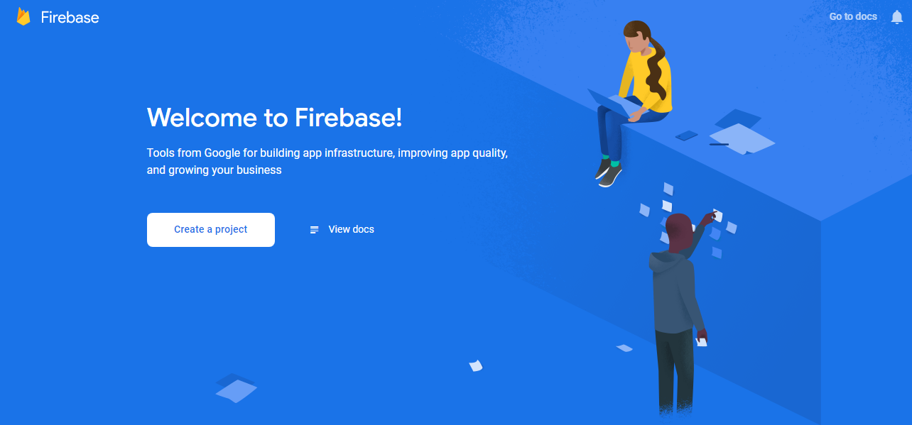

Firebase is a mobile and web application development platform that helps developers to focus on their front-end rather than solving the puzzles and issues in the back-end. If you’re among those who wanted to dive deep into cloud-computing and got discouraged as you weren’t willing to rip your pockets off, there’s happy news for you. You can get started with Firebase for free (Not even credit card details are needed).
***
You can find more details about cloud computing in our [previous article](/modtech-cloud).

You can create and deploy your APIs on the cloud for free (The basic account has some restrictions though).

Let's have a look at what Firebase offers:

***
## Prerequisites:
- A decent knowledge of JavaScript
- Prior experince with ExpressJS will be awesome
Don't worry if you don't know any of those. Have look at our other posts:

[Basic Coding](/basic-coding) or [Online-Learning](/learn-online)
***

## Create a Firebase account

As mentioned before, it’s free and simple. All you need is to authenticate with your existing Google account. 
Head over to [firebase.google.com](http://firebase.google.com) and click get started and authenticate with your existing Google account.

## Create a new project

The Firebase console is where you do most of the work.

Go to [console.firebase.google.com](http://console.firebase.google.com) and explore your console.

- You can create a new project, or explore some demo project.
- Click on create project, You’ll be prompted to give a name for your project
- Just below the name, you’ll see an id. **This is important**. You can edit the id as you like or keep it as it is, but you can’t change it after you create a project.
- Accept the terms and continue.
- It will ask if you need Google analytics in your project. (It’s up to you as we won’t cover that).
- Create your project.
- Done!

## Back to the console

Go to the Firebase console again (You’ll be redirected after creating the project).
- Click on your project and you’ll see details about your project, the current plan, etc.
- On the left navigator, you’ll see the option called Develop. This window shows what we can do with firebase. Let’s explore some of them:
  - Authentication: Options for integrating Google authentication into your app
  - Database: Handling of Databases.
  - Hosting: To host your website on GCP
  - Functions: Cloud functions to create and deploy your APIs

There’s a lot more to explore. Visit the official [Firebase Docs](https://firebase.google.com/docs) or [Firebase Youtube Channel](https://www.youtube.com/user/Firebase) for tutorials and Help.

>As this post is getting large, We’ll continue exploring firebase in the next Post. Keep exploring...
